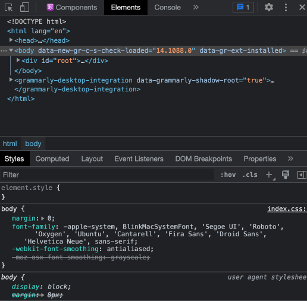
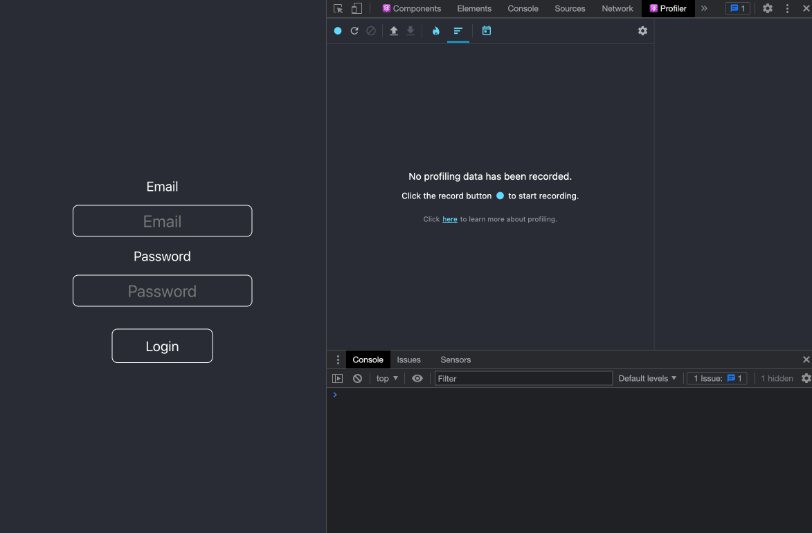
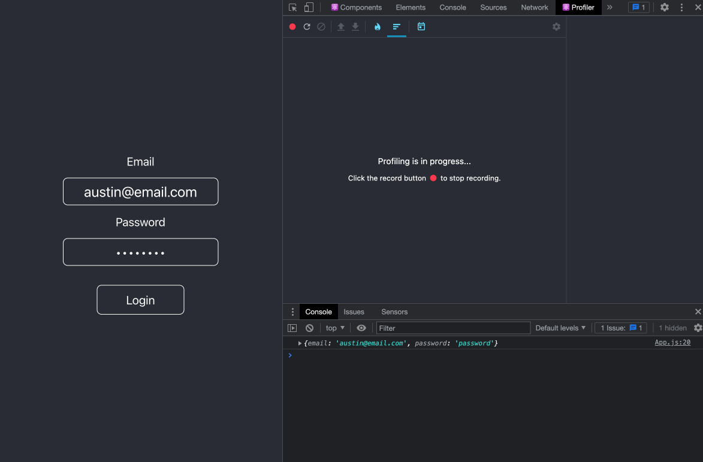
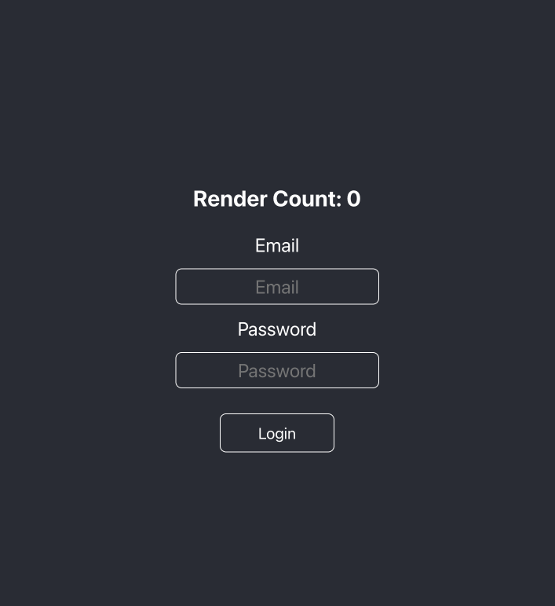
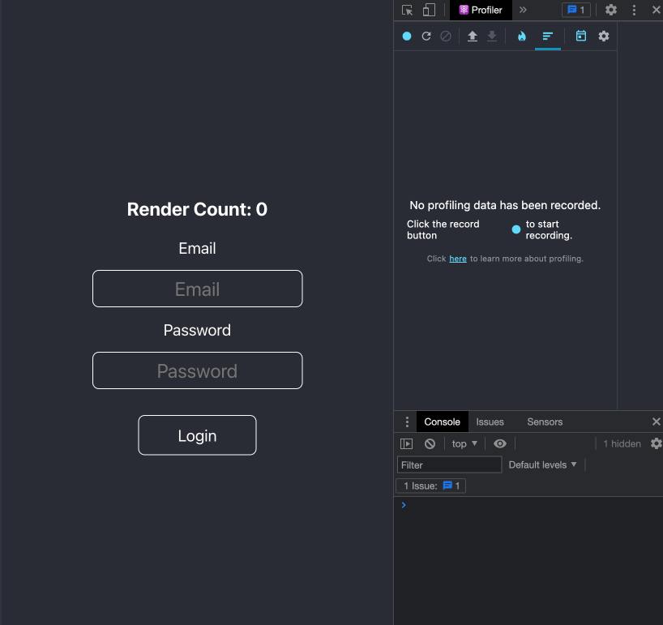
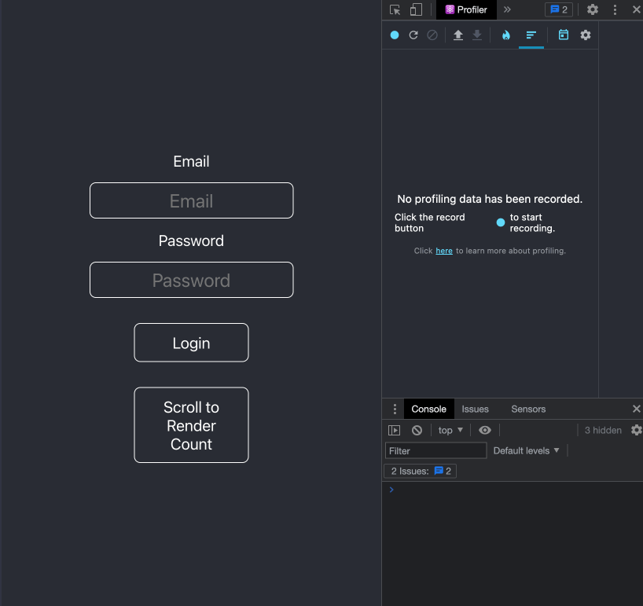

# `useRef` – Demystifying React Hooks (Pt. 3)


In this article, we will discuss some common use cases for React's `useRef`
Hook.

## Getting Started

We will use the Profiler from the React Dev Tools to see how our components are
rendering. If you don't have the React Dev Tools and plan to follow along,
you'll need to pause and download it now.

- [Chrome React Dev Tools](https://chrome.google.com/webstore/detail/react-developer-tools/fmkadmapgofadopljbjfkapdkoienihi)
- [Firefox React Dev Tools](https://addons.mozilla.org/en-US/firefox/addon/react-devtools/)

If you'd like, you can skim this as a
[Medium](https://medium.com/@austinrt/demystifying-react-hooks-useref-a2c7155d0cd5)
or [dev.to](https://dev.to/austinrt/demystifying-react-hooks-useref-4cff)
article.

- `fork and clone`
- `cd client`
- `npm i`
- `npm start`

## Starter Code

As always, we'll start with a tour of our codebase. This time, `App.js` is a
simulated Login Form.

We have `initialFormValues`, an object with a blank email and password, which we
use to initialize our `formValues` state.

```js
const initialFormValues = {
  email: '',
  password: ''
};

const [formValues, setFormValues] = useState(initialFormValues);
```

We then have boilerplate `handleChange` and `handleSubmit` functions, and the
`handleSubmit` logs `formValues` to the console.

```js
const handleChange = e => {
  setFormValues({
    ...formValues,
    [e.target.name]: e.target.value
  });
};

const handleSubmit = e => {
  e.preventDefault();
  console.log(formValues);
};
```

Finally, our JSX renders the form and assigns the appropriate `onChange` and
`onSubmit` attributes.

```js
return (
  <main>
    <section>
      <form onSubmit={handleSubmit}>
        <label htmlFor='email'>Email</label>
        <input
          type='email'
          name='email'
          placeholder='Email'
          onChange={handleChange}
        />
        <label htmlFor='password'>Password</label>
        <input
          type='password'
          name='password'
          placeholder='Password'
          onChange={handleChange}
        />
        <button type='submit'>Login</button>
      </form>
    </section>
  </main>
);
```

## What's the Problem?

So you may be asking, _"What's wrong with this component? It works as expected,
and I've written forms like this countless times."_

So have I, friend. So have I.

Open your React Dev Tools and click the Settings cog. Next, click the 'Profiler'
tab and tick on the option, "Record why each component rendered while
profiling."



Now open the Profiler tab, and you will see a blue dot in the upper left corner.
Click it to start profiling. Next, type in the inputs and click the (now red)
dot to stop profiling.



Click the App component on the left inside the `Profiler` tab, and you'll see a
list of all the renders. Notice the Profiler provides the same reason for each:

---

**Why did this render?**

- Hook 1 changed

---

The component re-rendered on every keystroke.



## Minimizing Renders

If our form's sole purpose is to submit the inputs elsewhere, then we don't need
the component to re-render in real time. We don't care what the value is while
the user is typing. We only care about the value when the form is submitted.

This may seem harmless in a small application, but it can significantly impact
our application as it scales. And part of being a good React developer is being
mindful of the performance of our applications by minimizing renders.

## Enter [`useRef`](https://beta.reactjs.org/apis/react/useRef)

In the broadest sense, the `useRef` Hook creates a mutable variable that
persists between renders. It provides the ability to store a value we can access
outside the render cycle.

Let's try using `useRef` to store our render count.

We'll start by importing `useRef` in our current import.

```js
import { useState, useRef } from 'react';
```

We will initialize `renders` with `useRef` and set it to 0. When we initialize a
`ref`, the Hook creates an object with a `current` property. `current` is the
property we must use to update the `ref`'s value.

```js
const rendersRef = useRef(0);
```

We'll use a `useEffect` Hook without the dependency array to increment `renders`
every time the component renders. And take note that we change the value of a
`ref`, unlike `useState`, we can do so **directly**.

```js
import { useState, useRef, useEffect } from 'react';

...

useEffect(() => {
  rendersRef.current++;
});
```

Let's render `renders` in our JSX.

```js
<section>
  <h3>Render Count: {rendersRef.current}</h3>
  <form onSubmit={handleSubmit}>
```

When we type in the input, we see our render count incrementing in real-time.
Neat, I guess, but not particularly useful.



From the React Docs:

<blockquote>
<code>useRef</code> returns a ref object with a single <code>current</code> property initially set to the initial value you provided.

On the next renders, <code>useRef</code> will return the same object. You can
change its <code>current</code> property to store information and read it later.
This might remind you of
<a href="https://beta.reactjs.org/apis/react/useState">state</a>, but there is
an important difference.

<strong>Changing a ref does not trigger a re-render.</strong> This means refs
are perfect for storing information that doesn’t affect the visual output of
your component.

</blockquote>

_...information that doesn’t affect the visual output of your component._

Kind of like a login form?

## Refactoring Our Form with `useRef`

Let's start by creating two new `refs` to store our `email` and `password`
values and initialize them as `null`.

```js
const emailRef = useRef(null);
const passwordRef = useRef(null);
```

When using the `useRef` Hook to reference a DOM element, associating it is
incredibly simple. All we need to do is add a `ref` attribute to the element and
provide it our `ref` variable as its value.

```js
<input
  type='email'
  name='email'
  placeholder='Email'
  ref={emailRef}
  onChange={handleChange}
  />

  ...

<input
  type='password'
  name='password'
  placeholder='Password'
  ref={passwordRef}
  onChange={handleChange}
  />
```

Next, we need to refactor our `handleSubmit` function. Instead of logging
`formValues`, we'll create an object, setting the values as each `ref`'s
`current` property.

```js
const handleSubmit = (e) => {
  e.preventDefault();
  console.log({
    email: emailRef.current.value
    password: passwordRef.current.value
    });
};
```

Type in the inputs and click `Login`. You should see your object logged properly
while the render count remains `0`. The Profiler also finds no activity.
Changing the value of our `ref`s did not cause the component to re-render.



With that working, we no longer need the following:

- email `onChange` attribute
- password `onChange` attribute
- `handleChange` function
- `formValues` state
- `initialFormValues` object
- `useState` import

<blockquote>
Though we aren't directly using it anymore, we should keep the <code>name</code> attributes for accessibility.
</blockquote>
<br/>

Test the application again. We removed a lot of code, but it still works as
expected!

## `useRef` vs. `useState`

This accurately demonstrates the point raised in the React Docs: updating
`useRef` does not trigger a re-render, which is probably the most significant
difference between `useRef` and `useState`.

In addition, you'll notice that when we updated the `current` property on our
`ref`, we did so directly. **Never** do this with `useState`. Instead, you must
always use the setter function if you wish your UI to _react_ to the change. You
can read about this behavior
[here](https://beta.reactjs.org/apis/react/useState#ive-updated-the-state-but-the-screen-doesnt-update).

<blockquote>
Yes, I know. We <strong>literally</strong> just used <code>useRef</code> to affect a change in the DOM. In my defense, try to use <code>useState</code> to track your render count and include itself in that count. If you can figure out a way without causing an infinite re-render, please reach out. I'd like you to teach me!
</blockquote>
<br/>

## One Last Use Case

Before concluding this article, I’d like to address what I think is the simplest
common use case for `useRef`. Let’s start by moving our render count below the
`section` tag containing our form. We’ll put it in its own section tag.

```js
<section>
  <h3>Render Count: {rendersRef.current}</h3>
</section>
```

Next, we will create a `formRef` for our form and assign it accordingly. Let’s
add a button with the text, `Scroll to Render Count`.

```js
const formRef = useRef(null);
...
<section ref={formSectionRef}>
  <form onSubmit={handleSubmit}>
...
  </form>
<button>Scroll to Render Count</button>
```

Then we will initialize `renderCountSectionRef`, assign it to our render count
container, and add a button with the text `Scroll to Form`.

```js
const renderCountSectionRef = useRef(null);
...
<section ref={renderCountSectionRef}>
  <h3>Render Count: {rendersRef.current}</h3>
  <button>Scroll to Form</button>
</section>
```

Let’s create a new function called `scrollToElement` that expects a `ref` as a
parameter and scrolls us to said `ref`.

```js
const scrollToElement = ref => {
  ref.current.scrollIntoView({ behavior: 'smooth' });
};
```

Now, we will set the `onClick` property to `scrollToElement` with the
appropriate `ref` as its argument.

<blockquote>
Please note that using inline functions will make for a less performant app, but that refactor would require more custom logic and is outside the scope of this article.
</blockquote>
<br/>

```js
<button
  onClick={() => {
    scrollToElement(renderCountSectionRef);
  }}
>
  Scroll to Render Count
</button>

...

<button
  onClick={() => {
    scrollToElement(formSectionRef);
  }}
>
  Scroll to Form
</button>
```

Now, when we click the buttons, we scroll about the page! This feels a lot like
a `Scroll To Top` or `Jump to Recipe` button, doesn't it?



Since scrolling to a specific element doesn't demand a re-render, it is a much
better use case for `useRef` than `useState`.

## A Caution

After realizing that we can affect changes on DOM Elements directly with
`useRef`, it may be tempting to use this method as an analog to `querySelector`
or `getElementBy—`.

This is an anti-pattern and should be avoided if possible. It can cause your UI
to fall out of sync with your state and, in a larger application, can have an
unforeseen ripple effect. These bugs will be challenging to track down.

## Conclusions

In this article, we discussed the functionality of `useRef`, how it persists
through renders, and how, unlike `useState`, it does not cause re-renders. We
also explored one of the most common uses of `useRef`: to navigate our user to
different DOM elements.

<hr/>
I’m always looking for new friends and colleagues. If you found this article
helpful and would like to connect, you can find me at any of my homes on the
web.

[GitHub](https://github.com/austin-rt) | [Twitter](https://twitter.com/0xStink)
| [LinkedIn](https://www.linkedin.com/in/austinrt) |
[Website](https://austinrt.io) | [Medium](https://austinrt.medium.com/) |
[Dev.to](https://dev.to/austinrt)

<hr/>

## Resources

- [GitHub Repo](https://github.com/austin-rt/useRef)
- <code>[useRef](https://beta.reactjs.org/docs/hooks-reference.html#useref)</code>
- <code>[useState](https://beta.reactjs.org/docs/hooks-reference.html#usestate)</code>
- [React Profiler](https://beta.reactjs.org/blog/2018/09/10/introducing-the-react-profiler#profiling-an-application)
- [React Dev Tools for Chrome](https://chrome.google.com/webstore/detail/react-developer-tools/fmkadmapgofadopljbjfkapdkoienihi?hl=en)
- [React Dev Tools for Firefox](https://addons.mozilla.org/en-US/firefox/addon/react-devtools/)
